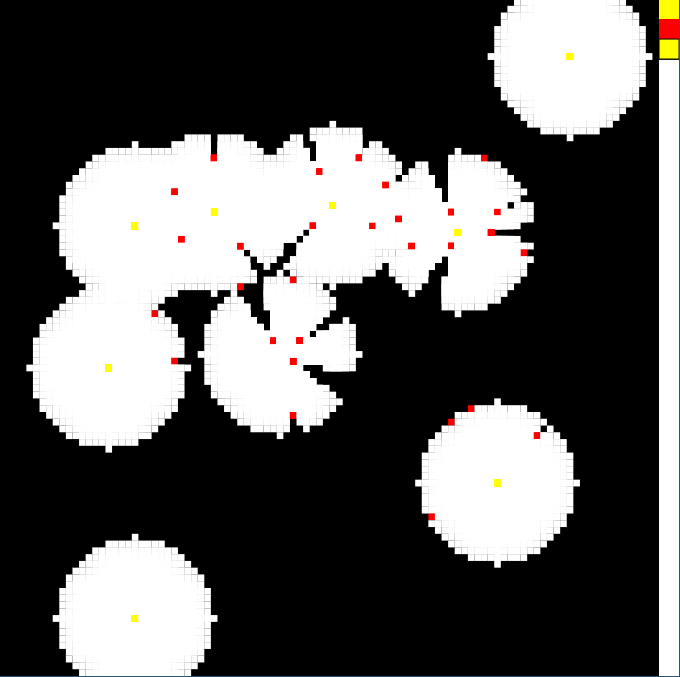

# Raytracer test

You have a grid, all dark. You have some tools: lights (yellow) and
obstacles (red). Select your tool on the right, the 3rd color is the
currently selected tool. You can put obstacles and lights in the grid.
You have an extra light following your mouse. Enjoy :-)

## TODO

Optimise, it is slow with a few lights....

## Try it

Demo: http://padawin.github.io/raytracing-test/
